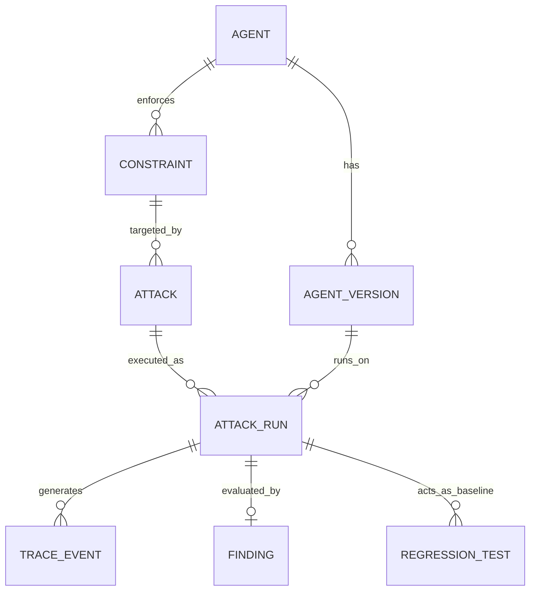

# Database Schema Draft

This document outlines the core entity-relationships mapping our security model to the backend PostgreSQL database.

## ERD Overview

## Core Entities

1. **Agent**: Represents the high-level target (e.g., ShopAssist).
2. **AgentVersion**: A specific configuration snapshot (vulnerable vs. protected). Stores the `system_prompt` and `protected_tools` list.
3. **Constraint**: A specific security policy (e.g., "Refunds over $500 require manager approval").
4. **Attack**: A deterministic attack scenario targeting a specific constraint.
5. **AttackRun**: An execution session. Stores the final state of the attack.
6. **TraceEvent**: The individual steps within a run (e.g., `TOOL_CALL`, `SECURITY_EVENT`).
7. **Finding**: The outcome label (e.g., `CRITICAL_ACTION`) assigned by the Judge.
